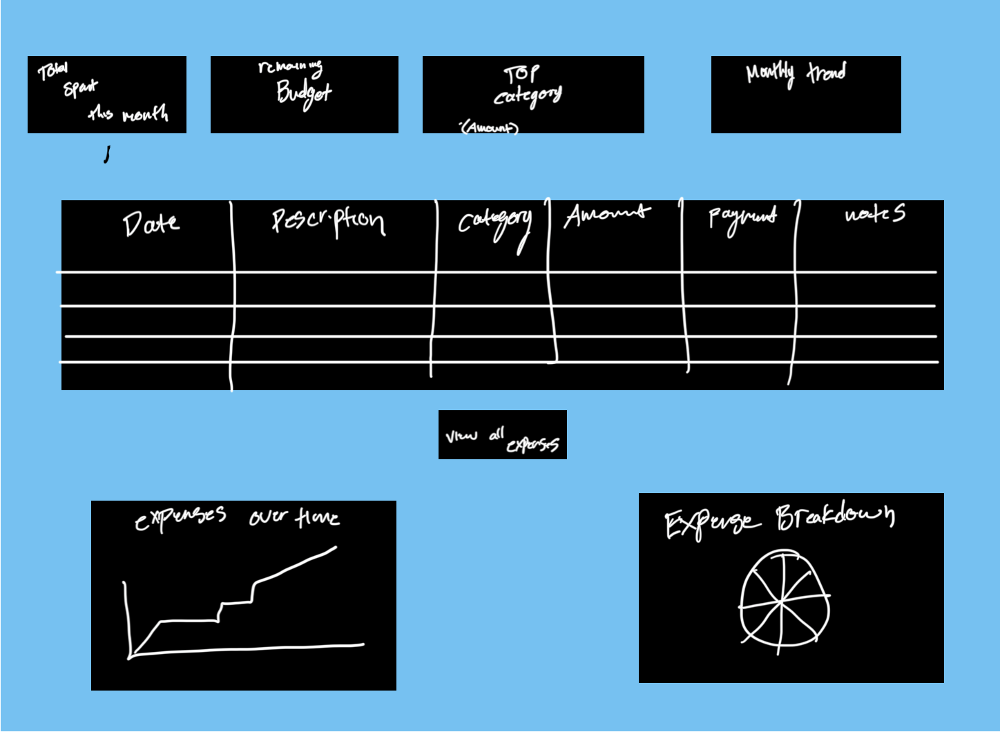
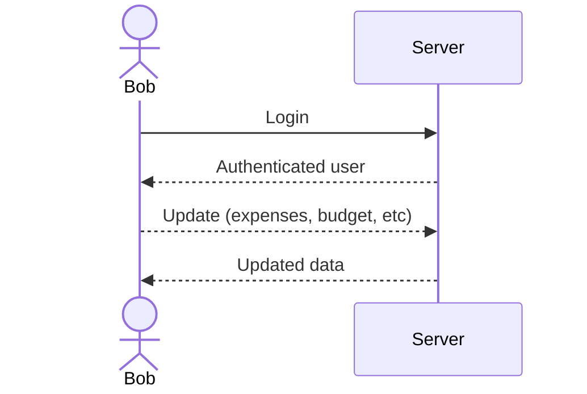

# Spreadsheet-like Finances

[My Notes](startup/notes.md)

This application is a spreadsheet-like finances application. It allows users to create accounts, log in, and view their finances. The setup is simple
to understand. You can see everything at a glance. When a user logs in, they will be able to see the total you have spent in the month, your remaining budget, the 
categories that is accounting for most of your spending, as well as your monthly trend. From this page you will also be able to see a graph of your expenses over time as 
well as a breakdown of your spending by category.

> [!NOTE]
>  This is a template for your startup application. You must modify this `README.md` file for each phase of your development. You only need to fill in the section for each deliverable when that deliverable is submitted in Canvas. Without completing the section for a deliverable, the TA will not know what to look for when grading your submission. Feel free to add additional information to each deliverable description, but make sure you at least have the list of rubric items and a description of what you did for each item.

> [!NOTE]
>  If you are not familiar with Markdown then you should review the [documentation](https://docs.github.com/en/get-started/writing-on-github/getting-started-with-writing-and-formatting-on-github/basic-writing-and-formatting-syntax) before continuing.

## 🚀 Specification Deliverable

> [!NOTE]
>  Fill in this sections as the submission artifact for this deliverable. You can refer to this [example](https://github.com/webprogramming260/startup-example/blob/main/README.md) for inspiration.

For this deliverable I did the following. I checked the box `[x]` and added a description for things I completed.

- [x] Proper use of Markdown
- [x] A concise and compelling elevator pitch
- [x] Description of key features
- [x] Description of how you will use each technology
- [x] One or more rough sketches of your application. Images must be embedded in this file using Markdown image references.

### Elevator pitch

My web app brings the simplicity of a spreadsheet to personal finance. Users can log expenses, see totals, 
and track spending trends in real time, all in a familiar, table-based interface. With intuitive charts and category breakdowns, 
it’s easy to understand where your money goes each month and make smarter financial decisions. This web app is 
perfect for anyone looking to track their finances and stay on top of their spending without having a 
complex spreadsheet or complicated interface to work with.
### Design

Here is a sequence diagram that shows how to people would interact 
the application to update and see their data.

```mermaid
sequenceDiagram
    actor Bob
    Bob->>Server: Login
    Server -->>Bob: Authenticated user
    Bob -->>Server: Update (expenses, budget, etc)
    Server -->>Bob: Updated data
```

### Key features

- Spreadsheet-like interface for easy data entry and viewing
- Automatic totals and summaries 
- visual spending insights
- category organizaton

### Technologies

I am going to use the required technologies in the following ways.

- **HTML** - Three main pages: Login, Dashboard, all expenses
- **CSS** - Spreadsheet-like styling, charts, styling that looks good on different screen sizes and uses good whitespace
- **React** - Provides login, update of graphical data, and charts
- **Service** - Backend service that handles data storage and authentication
- **DB/Login** - Stores user data and credentials in MongoDB
- **WebSocket** - live updates if user logs runs from multiple devices for collaborative use.

## 🚀 AWS deliverable

For this deliverable I did the following. I checked the box `[x]` and added a description for things I completed.

- [x] **Server deployed and accessible with custom domain name** - [My server link](https://financesheet.click/).

## 🚀 HTML deliverable

For this deliverable I did the following. I checked the box `[x]` and added a description for things I completed.

- [x] **HTML pages** - Created a page for each part of the application.
- [x] **Proper HTML element usage** - I mostly used tables and buttons to show where things will be.
- [x] **Links** - All pages navigate to each other.
- [x] **Text** - All text is placeholder text.
- [x] **3rd party API placeholder** - I have a placeholder at the bottom of the overview page where the user will type the company to get the stock price.
- [x] **Images** - Added logo image to the login page.
- [x] **Login placeholder** - I used the same login template from Simon
- [x] **DB data placeholder** - This will be the expenses page
- [x] **WebSocket placeholder** - On the all sheets page, there is an option to share your sheet, the user can then share it with another user, they can both edit it at the same time.

## 🚀 CSS deliverable

For this deliverable I did the following. I checked the box `[x]` and added a description for things I completed.

- [x] **Header, footer, and main content body** - All standardized to look the same across all pages.
- [x] **Navigation elements** - There is navigation between all pages and it is standarized to look the same.
- [x] **Responsive to window resizing** - Created a responsive design to work on mobile as well as desktop.
- [x] **Application elements** - Created a spreadsheet design for the overview page as well as the expense page. Overview page also has different breakdown boxes.
- [x] **Application text content** - Using the Sans-serif font for all text, for now most is placeholder text.
- [x] **Application images** - Included a logo on the login page.

## 🚀 React part 1: Routing deliverable

For this deliverable I did the following. I checked the box `[x]` and added a description for things I completed.

- [x] **Bundled using Vite** - I did complete this part of the deliverable.
- [x] **Components** - I did complete this part of the deliverable.
- [x] **Router** - I did complete this part of the deliverable.

## 🚀 React part 2: Reactivity deliverable

For this deliverable I did the following. I checked the box `[x]` and added a description for things I completed.

- [x] **All functionality implemented or mocked out** - I used localstorage to store users and passwords because we don't have a database implemented yet. All data is stored with the user as part of the key so that only that user has access to that data. I used setInterval to add mock notifications of users sharing sheets and making edits to the different sheets. This will be replaced with the websocket when we get to that point. On the overview page, I also have a mockExchange rate, this will be the API call for the user to get currency conversion rates. For now it is a simple function call. 
- [x] **Hooks** - I used useState for functionalities like username, and password to have exact experience be personalized to the user. With this I also used useState so that each user had different sheets and budget. I also used it to display calculated amounts on the overview page, show notifications and change what kind of graph they see on the overview page. I used useNavigate so that when the user wants to edit a spcific sheet, they are then moved to a different page. I also used this for the login and logout buttons. I used the useEffect hook to load data from local storage such as the sheets for a user. Each user has their own exeperience. 
## 🚀 Service deliverable

For this deliverable I did the following. I checked the box `[x]` and added a description for things I completed.

- [x] **Node.js/Express HTTP service** - Imported express into index.js and the server runs
- [x] **Static middleware for frontend** - I used `app.use(express.static('/public') to tell express to use the react files in public
- [x] **Calls to third party endpoints** - I am using an API call to fixer.io to get currency exchange rates for 5 currencies
- [x] **Backend service endpoints** - Using POST, GET and DELETE endpoints for each of the pages to transfer data from page to page.
      Auth uses 2 POST and a DELETE (POST /api/auth/create, POST /api/auth/login, DELETE /api/auth/logout)
      Sheets uses 2 POST 1 GET 1 DELETE (GET /api/sheets, POST /api/sheets, DELETE /api/sheets/:id, POST /api/sheets/:id/rename)
      Expenses uses 1 GET and 2 POST (GET /api/expenses?sheetId=..., POST /api/expenses, POST /api/expenses/:id/update)
      
- [x] **Frontend calls service endpoints** -
      login.jsx calls POST /api/auth/login and POST /api/auth/create when the user clicks Login or Create
      sheets.jsx calls GET /api/sheets on load, POST /api/sheets to create, DELETE /api/sheets/:id to delete, and
      POST /api/sheets/:id/rename on every rename input change
      expenses.jsx calls GET /api/expenses?sheetId=... on load, POST /api/expenses to add a row, and
      POST /api/expenses/:id/update on every field edit
      overview.jsx calls GET /api/sheets and GET /api/expenses to populate the stats and charts, plus /api/exchange-           rate for the currency converter
- [x] **Supports registration, login, logout, and restricted endpoint** - In index.js, the password is hashed, and the user is stored. Login finds and verifies the user, logout delete the token and clears the cookie. For the restricted Endpoitns, VerifyAuth runs before every sheet and expense endpoint so we can match the sheets and expenses to the user. 

## 🚀 DB deliverable

For this deliverable I did the following. I checked the box `[x]` and added a description for things I completed.

- [X] **Stores data in MongoDB** - Added functionality to have the expenses and sheets saved in MongoDB. They are no longer stored in local storage. Currentsheet is saved in localstorage. 
- [X] **Stores credentials in MongoDB** - Added functionality to have the users username and password saved in MongoDB. They are no longer stored in local storage. Username is also saved in localstorage to display the name that the user is logged in as (ex. Logged in as ....)

## 🚀 WebSocket deliverable

For this deliverable I did the following. I checked the box `[x]` and added a description for things I completed.

- [ ] **Backend listens for WebSocket connection** - I did not complete this part of the deliverable.
- [ ] **Frontend makes WebSocket connection** - I did not complete this part of the deliverable.
- [ ] **Data sent over WebSocket connection** - I did not complete this part of the deliverable.
- [ ] **WebSocket data displayed** - I did not complete this part of the deliverable.
- [ ] **Application is fully functional** - I did not complete this part of the deliverable.
