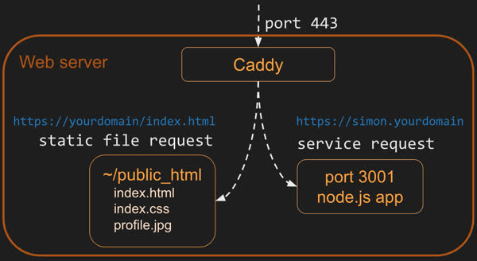
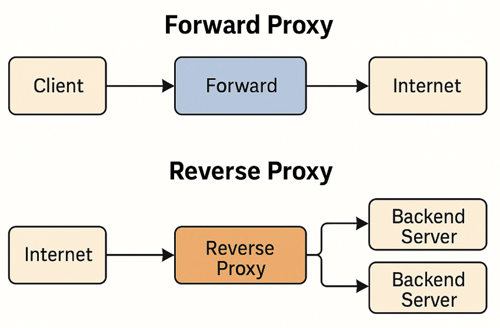

# CS 260 Notes

[My startup - Simon](https://simon.cs260.click)

## Helpful links

- [Course instruction](https://github.com/webprogramming260)
- [Canvas](https://byu.instructure.com)
- [MDN](https://developer.mozilla.org)

# Helpful Terminal Commands

| Command | Meaning |
|--------|--------|
| `echo` | Output the parameters of the command |
| `cd` | Change directory |
| `mkdir` | Make directory |
| `rmdir` | Remove directory |
| `rm` | Remove file(s) |
| `mv` | Move file(s) |
| `cp` | Copy file(s) |
| `ls` | List files |
| `curl` | Command-line client URL browser |
| `grep` | Regular expression search |
| `find` | Find files |
| `top` | View running processes with CPU and memory usage |
| `df` | View disk statistics |
| `cat` | Output the contents of a file |
| `less` | Interactively output the contents of a file |
| `wc` | Count words in a file |
| `ps` | View currently running processes |
| `kill` | Kill a currently running process |
| `sudo` | Execute a command as a super user (admin) |
| `ssh` | Create a secure shell on a remote computer |
| `scp` | Securely copy files to a remote computer |
| `history` | Show the history of commands |
| `ping` | Check if a website is up |
| `tracert` | Trace the connections to a website |
| `dig` | Show DNS information for a domain |
| `man` | Look up a command in the manual |


# Vim Keystroke Reference

| Keystroke | Meaning |
|---------|--------|
| `:h` | Help |
| `i` | Enter insert mode. Allows typing and deleting text. Press `ESC` to exit insert mode. No other commands work while in insert mode. |
| `u` | Undo |
| `CTRL-r` | Redo |
| `gg` | Go to beginning of file |
| `G` | Go to end of file |
| `/` | Search for text typed after `/` |
| `n` | Next search match |
| `N` | Previous search match |
| `v` | Visually select text |
| `y` | Yank (copy) selected text to clipboard |
| `p` | Paste clipboard |
| `CTRL-w v` | Split window vertically |
| `CTRL-w w` | Toggle windows |
| `CTRL-w q` | Close current window |
| `:e` | Open a file. Type-ahead available. Opening a directory allows navigation in the window |
| `:w` | Write file (save) |
| `:q` | Quit. Use `:q!` to exit without saving |


## AWS

My elastic IP address is: 98.82.211.73

- this is the command to ssh into the server: ssh -i [key pair file] unbuntu@[ip address]
- key file is saved in keys folder
- Go to EC2 dashboard to see the server
- domain is financesheet.click
- go to Route 53 to manage domain name and DNS records.

## Caddy




[link to Caddy documentation](https://caddyserver.com/docs/caddyfile)

No problems worked just like it said in the [instruction](https://github.com/webprogramming260/.github/blob/main/profile/webServers/https/https.md).



with caddy reverse proxy, domain is
https://financesheet.click/


### HTTPS, TLS, and certificates

[link to TSL documentation](https://developer.mozilla.org/en-US/docs/Web/Security/Defenses/Transport_Layer_Security)
[link to Let's encrypt documentation](https://letsencrypt.org/how-it-works/)

## HTML

#### helpful links for HTML
[link to some tutorials](https://developer.mozilla.org/en-US/docs/Web/HTML)

#### Common HTML Elements
| Element        | Meaning                                                          |
|----------------|------------------------------------------------------------------|
| `html`         | The page container                                               |
| `head`         | Header information                                               |
| `title`        | Title of the page                                                |
| `meta`         | Metadata for the page such as character set or viewport settings |
| `script`       | JavaScript reference (external or inline)                        |
| `include`      | External content reference                                       |
| `body`         | The entire content body of the page                              |
| `header`       | Header of the main content                                       |
| `footer`       | Footer of the main content                                       |
| `nav`          | Navigational inputs                                              |
| `main`         | Main content of the page                                         |
| `section`      | A section of the main content                                    |
| `aside`        | Aside content from the main content                              |
| `div`          | A block division of content                                      |
| `span`         | An inline span of content                                        |
| `h<1-9>`       | Text heading, from h1 (highest) to h9 (lowest)                   |
| `p`            | A paragraph of text                                              |
| `b`            | Bring attention                                                  |
| `table`        | Table                                                            |
| `tr`           | Table row                                                        |
| `th`           | Table header                                                     |
| `td`           | Table data                                                       |
| `ol`, `ul`     | Ordered or unordered list                                        |
| `li`           | List item                                                        | 
| `a`            | Anchor text to a hyperlink                                       |
| `img`          | Graphical image reference                                        |
| `dialog`       | Interactive component such as a confirmation                     |
| `form`         | A collection of user input                                       |
| `input`        | User input field                                                 |
| `audio`        | Audio content                                                    |
| `video`        | Video content                                                    |
| `svg`          | Scalable vector graphic content                                  |
| `iframe`       | Inline frame of another HTML page                                |

Comment with <!-- and ending it with -->

[link to CodePen exercise](https://codepen.io/leesjensen/pen/GRGBqbw)
[Link to CodePen Input exercise](https://codepen.io/leesjensen/pen/dyVdNej)

#### Input Elements
| Element      | Meaning                              | Example |
|--------------|--------------------------------------|---------|
| `form`       | Input container and submission       | `<form action="form.html" method="post">` |
| `fieldset`   | Labeled input grouping               | `<fieldset> ... </fieldset>` |
| `input`      | Multiple types of user input         | `<input type="" />` |
| `select`     | Selection dropdown                   | `<select><option>1</option></select>` |
| `optgroup`   | Grouped selection dropdown           | `<optgroup><option>1</option></optgroup>` |
| `option`     | Selection option                     | `<option selected>option2</option>` |
| `textarea`   | Multiline text input                 | `<textarea></textarea>` |
| `label`      | Individual input label               | `<label for="range">Range: </label>` |
| `output`     | Output of input                      | `<output for="range">0</output>` |
| `meter`      | Display value with a known range     | `<meter min="0" max="100" value="50"></meter>` |


## CSS

This took a couple hours to get it how I wanted. It was important to make it responsive and Bootstrap helped with that. It looks great on all kinds of screen sizes.

Bootstrap seems a bit like magic. It styles things nicely, but is very opinionated. You either do, or you do not. There doesn't seem to be much in between.

I did like the navbar it made it super easy to build a responsive header.

```html
      <nav class="navbar navbar-expand-lg bg-body-tertiary">
        <div class="container-fluid">
          <a class="navbar-brand">
            
            Calmer
          </a>
          <button class="navbar-toggler" type="button" data-bs-toggle="collapse" data-bs-target="#navbarSupportedContent">
            <span class="navbar-toggler-icon"></span>
          </button>
          <div class="collapse navbar-collapse" id="navbarSupportedContent">
            <ul class="navbar-nav me-auto mb-2 mb-lg-0">
              <li class="nav-item">
                <a class="nav-link active" href="play.html">Play</a>
              </li>
              <li class="nav-item">
                <a class="nav-link" href="about.html">About</a>
              </li>
              <li class="nav-item">
                <a class="nav-link" href="index.html">Logout</a>
              </li>
            </ul>
          </div>
        </div>
      </nav>
    </header>
```

I also used SVG to make the icon and logo for the app. This turned out to be a piece of cake.

```html
<svg width="100" height="100" xmlns="http://www.w3.org/2000/svg">
  <rect width="100" height="100" fill="#0066aa" rx="10" ry="10" />
  <text x="50%" y="50%" dominant-baseline="central" text-anchor="middle" font-size="72" font-family="Arial" fill="white">C</text>
</svg>
```

## React Part 1: Routing

Setting up Vite and React was pretty simple. I had a bit of trouble because of conflicting CSS. This isn't as straight forward as you would find with Svelte or Vue, but I made it work in the end. If there was a ton of CSS it would be a real problem. It sure was nice to have the code structured in a more usable way.

## React Part 2: Reactivity

This was a lot of fun to see it all come together. I had to keep remembering to use React state instead of just manipulating the DOM directly.

Handling the toggling of the checkboxes was particularly interesting.

```jsx
<div className="input-group sound-button-container">
  {calmSoundTypes.map((sound, index) => (
    <div key={index} className="form-check form-switch">
      <input
        className="form-check-input"
        type="checkbox"
        value={sound}
        id={sound}
        onChange={() => togglePlay(sound)}
        checked={selectedSounds.includes(sound)}
      ></input>
      <label className="form-check-label" htmlFor={sound}>
        {sound}
      </label>
    </div>
  ))}
</div>
```
