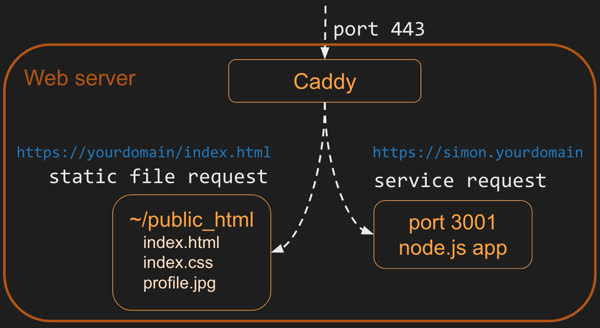
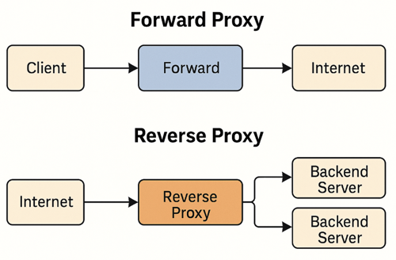

# CS 260 Notes

[My startup - Simon](https://simon.cs260.click)

## Helpful links

- [Course instruction](https://github.com/webprogramming260)
- [Canvas](https://byu.instructure.com)
- [MDN](https://developer.mozilla.org)

# Helpful Terminal Commands

| Command | Meaning |
|--------|--------|
| `echo` | Output the parameters of the command |
| `cd` | Change directory |
| `mkdir` | Make directory |
| `rmdir` | Remove directory |
| `rm` | Remove file(s) |
| `mv` | Move file(s) |
| `cp` | Copy file(s) |
| `ls` | List files |
| `curl` | Command-line client URL browser |
| `grep` | Regular expression search |
| `find` | Find files |
| `top` | View running processes with CPU and memory usage |
| `df` | View disk statistics |
| `cat` | Output the contents of a file |
| `less` | Interactively output the contents of a file |
| `wc` | Count words in a file |
| `ps` | View currently running processes |
| `kill` | Kill a currently running process |
| `sudo` | Execute a command as a super user (admin) |
| `ssh` | Create a secure shell on a remote computer |
| `scp` | Securely copy files to a remote computer |
| `history` | Show the history of commands |
| `ping` | Check if a website is up |
| `tracert` | Trace the connections to a website |
| `dig` | Show DNS information for a domain |
| `man` | Look up a command in the manual |


# Vim Keystroke Reference

| Keystroke | Meaning |
|---------|--------|
| `:h` | Help |
| `i` | Enter insert mode. Allows typing and deleting text. Press `ESC` to exit insert mode. No other commands work while in insert mode. |
| `u` | Undo |
| `CTRL-r` | Redo |
| `gg` | Go to beginning of file |
| `G` | Go to end of file |
| `/` | Search for text typed after `/` |
| `n` | Next search match |
| `N` | Previous search match |
| `v` | Visually select text |
| `y` | Yank (copy) selected text to clipboard |
| `p` | Paste clipboard |
| `CTRL-w v` | Split window vertically |
| `CTRL-w w` | Toggle windows |
| `CTRL-w q` | Close current window |
| `:e` | Open a file. Type-ahead available. Opening a directory allows navigation in the window |
| `:w` | Write file (save) |
| `:q` | Quit. Use `:q!` to exit without saving |


## AWS

My elastic IP address is: 98.82.211.73

- this is the command to ssh into the server: ssh -i [key pair file] unbuntu@[ip address]
- key file is saved in keys folder
- Go to EC2 dashboard to see the server
- domain is financesheet.click
- go to Route 53 to manage domain name and DNS records.

## Caddy




[link to Caddy documentation](https://caddyserver.com/docs/caddyfile)

No problems worked just like it said in the [instruction](https://github.com/webprogramming260/.github/blob/main/profile/webServers/https/https.md).



with caddy reverse proxy, domain is
https://financesheet.click/


### HTTPS, TLS, and certificates

[link to TSL documentation](https://developer.mozilla.org/en-US/docs/Web/Security/Defenses/Transport_Layer_Security)
[link to Let's encrypt documentation](https://letsencrypt.org/how-it-works/)

## HTML

#### helpful links for HTML
[link to some tutorials](https://developer.mozilla.org/en-US/docs/Web/HTML)

#### Common HTML Elements
| Element        | Meaning                                                          |
|----------------|------------------------------------------------------------------|
| `html`         | The page container                                               |
| `head`         | Header information                                               |
| `title`        | Title of the page                                                |
| `meta`         | Metadata for the page such as character set or viewport settings |
| `script`       | JavaScript reference (external or inline)                        |
| `include`      | External content reference                                       |
| `body`         | The entire content body of the page                              |
| `header`       | Header of the main content                                       |
| `footer`       | Footer of the main content                                       |
| `nav`          | Navigational inputs                                              |
| `main`         | Main content of the page                                         |
| `section`      | A section of the main content                                    |
| `aside`        | Aside content from the main content                              |
| `div`          | A block division of content                                      |
| `span`         | An inline span of content                                        |
| `h<1-9>`       | Text heading, from h1 (highest) to h9 (lowest)                   |
| `p`            | A paragraph of text                                              |
| `b`            | Bring attention                                                  |
| `table`        | Table                                                            |
| `tr`           | Table row                                                        |
| `th`           | Table header                                                     |
| `td`           | Table data                                                       |
| `ol`, `ul`     | Ordered or unordered list                                        |
| `li`           | List item                                                        | 
| `a`            | Anchor text to a hyperlink                                       |
| `img`          | Graphical image reference                                        |
| `dialog`       | Interactive component such as a confirmation                     |
| `form`         | A collection of user input                                       |
| `input`        | User input field                                                 |
| `audio`        | Audio content                                                    |
| `video`        | Video content                                                    |
| `svg`          | Scalable vector graphic content                                  |
| `iframe`       | Inline frame of another HTML page                                |

Comment with <!-- and ending it with -->

[link to CodePen exercise](https://codepen.io/leesjensen/pen/GRGBqbw)
[Link to CodePen Input exercise](https://codepen.io/leesjensen/pen/dyVdNej)

#### Input Elements
| Element      | Meaning                              | Example |
|--------------|--------------------------------------|---------|
| `form`       | Input container and submission       | `<form action="form.html" method="post">` |
| `fieldset`   | Labeled input grouping               | `<fieldset> ... </fieldset>` |
| `input`      | Multiple types of user input         | `<input type="" />` |
| `select`     | Selection dropdown                   | `<select><option>1</option></select>` |
| `optgroup`   | Grouped selection dropdown           | `<optgroup><option>1</option></optgroup>` |
| `option`     | Selection option                     | `<option selected>option2</option>` |
| `textarea`   | Multiline text input                 | `<textarea></textarea>` |
| `label`      | Individual input label               | `<label for="range">Range: </label>` |
| `output`     | Output of input                      | `<output for="range">0</output>` |
| `meter`      | Display value with a known range     | `<meter min="0" max="100" value="50"></meter>` |


## CSS


### Selectors

#### combinators
| Combinator           | Meaning                        | Example        | Description                                      |
|---------------------|--------------------------------|----------------|--------------------------------------------------|
| Descendant          | A list of descendants          | body section   | Any section that is a descendant of a body       |
| Child               | A list of direct children      | section > p    | Any p that is a direct child of a section        |
| General sibling     | A list of siblings             | div ~ p        | Any p that has a div sibling                     |
| Adjacent sibling    | A list of adjacent sibling     | div + p        | Any p that has an adjacent div sibling           |


#### Declarations
| Property              | Value                             | Example                | Discussion                                                                 |
|-----------------------|-----------------------------------|------------------------|-----------------------------------------------------------------------------|
| background-color      | color                             | red                    | Fill the background color                                                   |
| border                | color width style                 | #fad solid medium      | Sets the border using shorthand where any or all of the values may be provided |
| border-radius         | unit                              | 50%                    | The size of the border radius                                               |
| box-shadow            | x-offset y-offset blur-radius color | 2px 2px 2px gray       | Creates a shadow                                                           |
| columns               | number                            | 3                      | Number of textual columns                                                  |
| column-rule           | color width style                 | solid thin black       | Sets the border used between columns using border shorthand                 |
| color                 | color                             | rgb(128, 0, 0)         | Sets the text color                                                        |
| cursor                | type                              | grab                   | Sets the cursor to display when hovering over the element                  |
| display               | type                              | none                   | Defines how to display the element and its children                        |
| filter                | filter-function                   | grayscale(30%)         | Applies a visual filter                                                    |
| float                 | direction                         | right                  | Places the element to the left or right in the flow                        |
| flex                  |                                   |                        | Flex layout. Used for responsive design                                    |
| font                  | family size style                 | Arial 1.2em bold       | Defines the text font using shorthand                                      |
| grid                  |                                   |                        | Grid layout. Used for responsive design                                    |
| height                | unit                              | .25em                  | Sets the height of the box                                                 |
| margin                | unit                              | 5px 5px 0 0            | Sets the margin spacing                                                    |
| max-[width/height]    | unit                              | 20%                    | Restricts the width or height to no more than the unit                     |
| min-[width/height]    | unit                              | 10vh                   | Restricts the width or height to no less than the unit                     |
| opacity               | number                            | .9                     | Sets how opaque the element is                                             |
| overflow              | [visible/hidden/scroll/auto]      | scroll                 | Defines what happens when the content does not fit in its box             |
| position              | [static/relative/absolute/sticky] | absolute               | Defines how the element is positioned in the document                     |
| padding               | unit                              | 1em 2em                | Sets the padding spacing                                                   |
| left                  | unit                              | 10rem                  | The horizontal value of a positioned element                               |
| text-align            | [start/end/center/justify]        | end                    | Defines how the text is aligned in the element                             |
| top                   | unit                              | 50px                   | The vertical value of a positioned element                                 |
| transform             | transform-function                | rotate(0.5turn)        | Applies a transformation to the element                                   |
| width                 | unit                              | 25vmin                 | Sets the width of the box                                                  |
| z-index               | number                            | 100                    | Controls the positioning of the element on the z axis                     |


#### Color
| Method        | Example                         | Description                                                                                                                                                |
|---------------|---------------------------------|------------------------------------------------------------------------------------------------------------------------------------------------------------|
| keyword       | red                             | A set of predefined colors (e.g. white, cornflowerblue, darkslateblue)                                                                                      |
| RGB hex       | #00FFAA22 or #0FA2               | Red, green, and blue as a hexadecimal number, with an optional alpha opacity                                                                                |
| RGB function  | rgb(128, 255, 128, 0.5)          | Red, green, and blue as a percentage or number between 0 and 255, with an optional alpha opacity percentage                                                  |
| HSL           | hsl(180, 30%, 90%, 0.5)          | Hue, saturation, and light, with an optional opacity percentage. Hue is the position on the 365 degree color wheel (red is 0 and 255). Saturation is how gray the color is, and light is how bright the color is. |

#### Animation
You can do a lot with CSS animations, here is an example:

[Watch Animation Example](https://codepen.io/leesjensen/pen/MWBjXNq)

[Floating Clouds Example](https://codepen.io/leesjensen/pen/wvXEaRq)


#### Responsive design
- Breakpoints:
  - The points at which a media query is introduced, and the layout changes.
#### Display
| Value  | Meaning                                                                                         |
|--------|-------------------------------------------------------------------------------------------------|
| none   | Don't display this element. The element still exists, but the browser will not render it.       |
| block  | Display this element with a width that fills its parent element. A p or div element has block display by default. |
| inline | Display this element with a width that is only as big as its content. A b or span element has inline display by default. |
| flex   | Display this element's children in a flexible orientation.                                      |
| grid   | Display this element's children in a grid orientation.                                          |


#### @Media
 - tell us which side of the screen (technically the viewport) is the longest.

This took a couple hours to get it how I wanted. It was important to make it responsive and Bootstrap helped with that. It looks great on all kinds of screen sizes.

Bootstrap seems a bit like magic. It styles things nicely, but is very opinionated. You either do, or you do not. There doesn't seem to be much in between.

I did like the navbar it made it super easy to build a responsive header.


#### CDN links for bootstrap
 - JS	https://cdn.jsdelivr.net/npm/bootstrap@5.2.3/dist/js/bootstrap.bundle.min.js
 - CSS	https://cdn.jsdelivr.net/npm/bootstrap@5.2.3/dist/css/bootstrap.min.css

#### Bootstrap
[Page Example](https://codepen.io/leesjensen/pen/JjZavjW)


### Feature comparison

| Feature          | Tailwind CSS                                      | Bootstrap                                                     |
|------------------|---------------------------------------------------|---------------------------------------------------------------|
| Philosophy       | Utility-first (build from primitives)             | Component-based (prebuilt UI components)                      |
| Customization    | Highly customizable via config (`tailwind.config.js`) | Customizable but more rigid without overrides                 |
| Design freedom   | Full control over spacing, color, layout          | Limited to pre-defined component styling                      |
| File size        | Smaller                                           | Larger due to bundled components and styles                   |
| Learning curve   | Steep at first as you learn native CSS            | Easy to get started                                           |
| JS dependency    | No JS (except if using plugins)                   | Depends on jQuery (Bootstrap ≤ 4) or native JS (Bootstrap 5)  |

```html

<nav class="navbar navbar-expand-lg bg-body-tertiary">
  <div class="container-fluid">
    <a class="navbar-brand">
      
      Calmer
    </a>
    <button class="navbar-toggler" type="button" data-bs-toggle="collapse" data-bs-target="#navbarSupportedContent">
      <span class="navbar-toggler-icon"></span>
    </button>
    <div class="collapse navbar-collapse" id="navbarSupportedContent">
      <ul class="navbar-nav me-auto mb-2 mb-lg-0">
        <li class="nav-item">
          <a class="nav-link active" href="play.html">Play</a>
        </li>
        <li class="nav-item">
          <a class="nav-link" href="about.html">About</a>
        </li>
        <li class="nav-item">
          <a class="nav-link" href="src/login/login.html">Logout</a>
        </li>
      </ul>
    </div>
  </div>
</nav>
</header>
```

I also used SVG to make the icon and logo for the app. This turned out to be a piece of cake.

```html
<svg width="100" height="100" xmlns="http://www.w3.org/2000/svg">
  <rect width="100" height="100" fill="#0066aa" rx="10" ry="10" />
  <text x="50%" y="50%" dominant-baseline="central" text-anchor="middle" font-size="72" font-family="Arial" fill="white">C</text>
</svg>
```

## React Part 1: Routing

### VITE
- **`npm run dev`** bundles code to a temporary directory for the Vite debug HTTP server
- **`npm run build`** bundles your application for production deployment
- **Build process:**
  - Executes the `build` script in `package.json`
  - Invokes the Vite CLI
  - Transpiles and minifies code
  - Injects proper JavaScript
  - Outputs deployment-ready files to `dist` subdirectory

### React
Must have a public folder, a src folder and 
a separate folder for each page.

Had some issues with the routing and the css, the different styles were conflicting. Decided to standarize the css to match all pages. If there is time in the future, I would like 
to fix a few more things. 

## React Part 2: Reactivity

### Arrow functions
- Arrow functions are a shorthand syntax for writing functions.
```jsx
const a = [1, 2, 3, 4];

// standard function syntax
a.sort(function (v1, v2) {
  return v1 - v2;
});
```
- The return statement is optional when using arrow functions. 
- Arrow functions inhert the "this" value from the surrounding code.
  - this is called a closure

### Arrays 
| Function  | Meaning                                              | When to Use It Conceptually                                      | Example                          |
|-----------|------------------------------------------------------|------------------------------------------------------------------|----------------------------------|
| push      | Add an item to the end of the array                 | When you want to grow an array                                  | `a.push(4)`                     |
| pop       | Remove an item from the end of the array            | When treating the array like a stack (LIFO)                     | `x = a.pop()`                   |
| slice     | Return a sub-array                                  | When you want a copy of part of an array (non-destructive)      | `a.slice(1, -1)`                |
| sort      | Sort an array in place                              | When you need items ordered (numbers, strings, objects, etc.)   | `a.sort((a, b) => b - a)`       |
| values    | Create an iterator for a `for...of` loop            | When explicitly iterating over values                           | `for (i of a.values()) { ... }` |
| find      | Return the first item that matches a condition      | When you need a single matching element                         | `a.find(i => i < 2)`            |
| forEach   | Run a function on each item                         | When performing side effects (logging, modifying external vars) | `a.forEach(console.log)`        |
| reduce    | Reduce array to a single value                      | When combining all items into one result (sum, object, etc.)    | `a.reduce((a, c) => a + c)`     |
| map       | Create a new array by transforming each item        | When converting data to a new form                              | `a.map(i => i + i)`             |
| filter    | Create a new array with some items removed          | When selecting items that match a condition                     | `a.filter(i => i % 2)`          |
| every     | Test whether all items match a condition            | When validating that everything meets a rule                    | `a.every(i => i < 3)`           |
| some      | Test whether at least one item matches              | When checking if any item meets a rule                          | `a.some(i => i < 1)`            |


### Objects and Classes
- Objects are unordered collections of key-value pairs.
- Classes are used to create custom data types.
- Somewhat similar to Java and C++ in structure but not in behavior. 

### Destructuring
example of destructuring an object with a default value:
```jsx
a = obj.a !== undefined ? obj.a : defaultValue
```


### Time and Interval

```jsx
setTimeout(() => console.log('time is up'), 2000);

console.log('timeout will happen later');
```

### Hooks

Exampl hooks
- useEffect

### Local Storage 
## Local Storage Functions

There are four main functions that can be used with `localStorage`.

| Function | Meaning |
|----------|----------|
| `setItem(name, value)` | Sets a named item's value into local storage |
| `getItem(name)` | Gets a named item's value from local storage |
| `removeItem(name)` | Removes a named item from local storage |
| `clear()` | Clears all items in local storage |

A local storage value must be of type string, number, or boolean. If you want to store a 
JavaScript object or array, then you must first convert it to a JSON string with JSON.stringify() on insertion, 
and parse it back to JavaScript with JSON.parse() when retrieved.
// arrow function syntax
a.sort((v1, v2) => v1 - v2);

This was a lot of fun to see it all come together. I had to keep remembering to use React state instead of just manipulating the DOM directly.

Handling the toggling of the checkboxes was particularly interesting.

```jsx
<div className="input-group sound-button-container">
  {calmSoundTypes.map((sound, index) => (
    <div key={index} className="form-check form-switch">
      <input
        className="form-check-input"
        type="checkbox"
        value={sound}
        id={sound}
        onChange={() => togglePlay(sound)}
        checked={selectedSounds.includes(sound)}
      ></input>
      <label className="form-check-label" htmlFor={sound}>
        {sound}
      </label>
    </div>
  ))}
</div>
```


### Startup Notes
- Traceroute - shows the path of packets from source to destination.
- | **TCI/IP Layer** | **Example**     | **Purpose**                                    |
  | ---------------- | --------------- | ---------------------------------------------- |
  | Application      | HTTPS           | Functionality like web browsing                |
  | Transport        | TCP             | Moving connection information packets          |
  | Internet         | IP              | Establishing connections and routing packets   |
  | Link             | Fiber, hardware | Physical network connections and data transfer |

## Ports
[link to port numbers](https://www.iana.org/assignments/service-names-port-numbers/service-names-port-numbers.xhtml)
| Port | Protocol |
|-----|----------|
| 20 | File Transfer Protocol (FTP) for data transfer |
| 22 | Secure Shell (SSH) for connecting to remote devices |
| 25 | Simple Mail Transfer Protocol (SMTP) for sending email |
| 53 | Domain Name System (DNS) for looking up IP addresses |
| 80 | Hypertext Transfer Protocol (HTTP) for web requests |
| 110 | Post Office Protocol (POP3) for retrieving email |
| 123 | Network Time Protocol (NTP) for managing time |
| 161 | Simple Network Management Protocol (SNMP) for managing network devices such as routers or printers |
| 194 | Internet Relay Chat (IRC) for chatting |
| 443 | HTTP Secure (HTTPS) for secure web requests |

## HTTP 
| Code | Text | Meaning |
|-----|------|---------|
| 100 | Continue | The service is working on the request |
| 200 | Success | The requested resource was found and returned as appropriate |
| 201 | Created | The request was successful and a new resource was created |
| 204 | No Content | The request was successful but no resource is returned |
| 304 | Not Modified | The cached version of the resource is still valid |
| 307 | Permanent redirect | The resource is no longer at the requested location. The new location is specified in the response location header |
| 308 | Temporary redirect | The resource is temporarily located at a different location. The temporary location is specified in the response location header |
| 400 | Bad request | The request was malformed or invalid |
| 401 | Unauthorized | The request did not provide a valid authentication token |
| 403 | Forbidden | The provided authentication token is not authorized for the resource |
| 404 | Not found | An unknown resource was requested |
| 408 | Request timeout | The request takes too long |
| 409 | Conflict | The provided resource represents an out of date version of the resource |
| 418 | I'm a teapot | The service refuses to brew coffee in a teapot |
| 429 | Too many requests | The client is making too many requests in too short of a time period |
| 500 | Internal server error | The server failed to properly process the request |
| 503 | Service unavailable | The server is temporarily down. The client should try again with an exponential back off |


| Verb | Meaning |
|-----|---------|
| GET | Get the requested resource. This can represent a request to get a single resource or a resource representing a list of resources. |
| POST | Create a new resource. The body of the request contains the resource. The response should include a unique ID of the newly created resource. |
| PUT | Update a resource. Either the URL path, HTTP header, or body must contain the unique ID of the resource being updated. The body of the request should contain the updated resource. The body of the response may contain the resulting updated resource. |
| DELETE | Delete a resource. Either the URL path or HTTP header must contain the unique ID of the resource to delete. |
| OPTIONS | Get metadata about a resource. Usually only HTTP headers are returned. The resource itself is not returned. |


| Status Code Range | Meaning |
|---|---|
| 1xx | Informational |
| 2xx | Success |
| 3xx | Redirect to some other location, or that the previously cached resource is still valid |
| 4xx | Client errors. The request is invalid |
| 5xx | Server errors. The request cannot be satisfied due to an error on the server |

| Header | Example | Meaning |
|---|---|---|
| Authorization | Bearer bGciOiJIUzI1NiIsI | A token that authorizes the user making the request |
| Accept | image/* | The format the client accepts. This may include wildcards |
| Content-Type | text/html; charset=utf-8 | The format of the content being sent. These are described using standard MIME types |
| Cookie | SessionID=39s8cgj34; csrftoken=9dck2 | Key value pairs that are generated by the server and stored on the client |
| Host | info.cern.ch | The domain name of the server. This is required in all requests |
| Origin | cs260.click | Identifies the origin that caused the request. A host may only allow requests from specific origins |
| Access-Control-Allow-Origin | https://cs260.click | Server response of what origins can make a request. This may include a wildcard |
| Content-Length | 368 | The number of bytes contained in the response |
| Cache-Control | public, max-age=604800 | Tells the client how it can cache the response |
| User-Agent | Mozilla/5.0 (Macintosh) | The client application making the request |


### Troubleshooting 502 Errors
- ssh into production server
- navigate to services 

## Authorization Application Setup

1. **Create the project directory**
```bash
mkdir authTest
cd authTest
```

2. **Create the service file**
   Save the provided code into a file named `service.js`.

3. **Install required dependencies**
```bash
npm install express cookie-parser uuid bcryptjs
```

4. **Start the web service**
```bash
node --watch service.js
```
Or press **F5** in VS Code to start the service.

5. **Test the service**

Open a new terminal window and use `curl` to test one of the endpoints.

```bash
curl http://localhost:3000
```


[bcrypt](https://en.wikipedia.org/wiki/Bcrypt)


WEBSOCKETS 

-- Allows for real-time communication between the client and the server.
```jsx
const protocol = window.location.protocol === 'http:' ? 'ws' : 'wss';
const socket = new WebSocket(`${protocol}://${window.location.host}`);
```
ws - websockets
wss - secure websockets

** debugging websockets **
